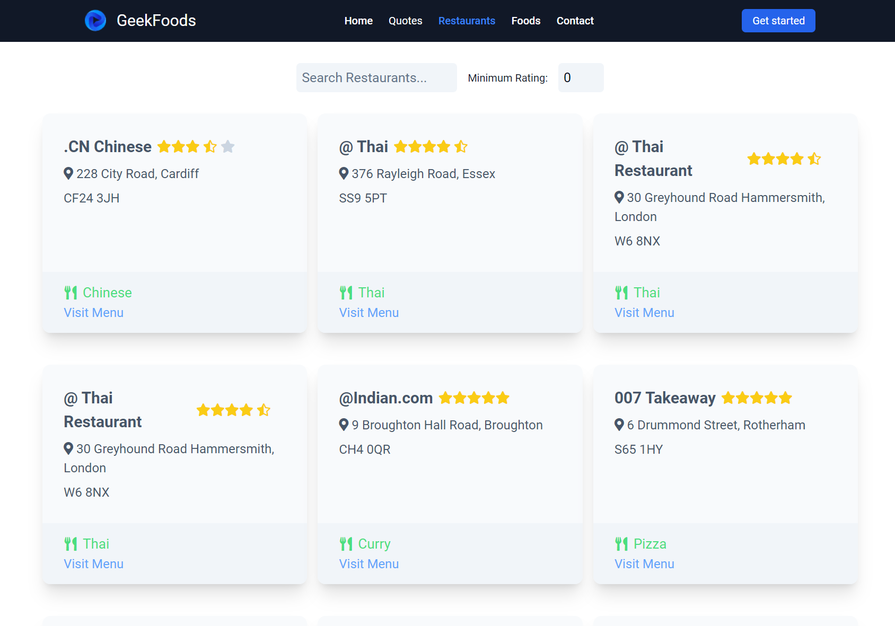

# Module#5 React Day#7 Homework: Restaurant Page 


## Hosted Version of the Project:
[m5react-day-7-homework-restaurant-page](https://m5react-day-7-homework-restaurant-page.vercel.app/)

## Objective
+ Developed a dynamic Restaurant Page using ReactJS.
+ Displayed a list of restaurants with their name, cuisine type, location, and rating.
+ Implemented dynamic filtering using React's useState hook to allow users to search for specific restaurants based on their preferences.


## How to install and run in yours local machine
```bash
npm install
npm run start
```

## Tech. Stack Used:
+ [React](https://react.dev/)
+ [TailwindCSS](https://tailwindcss.com/)
+ [Google Fonts](https://fonts.google.com/)
+ [Font Awesome](https://fontawesome.com/icons/)

## Author
[Abhishek kumar](https://www.linkedin.com/in/alex21c/), ([Geekster](https://geekster.in/) MERN Stack FS-14 Batch)


